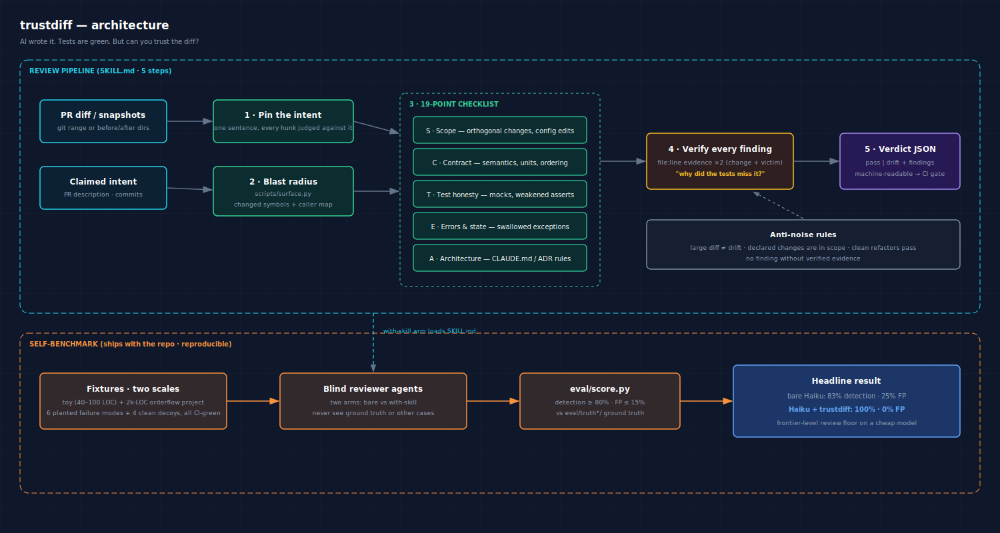

<h1 align="center">🔍 trustdiff</h1>

<p align="center">
  <b>AI wrote it. Tests are green. But can you trust the diff?</b><br>
  <sub>A Claude Code skill that catches the silent failures green tests can't — contract drift · scope creep · fake fixes · test masking — and ships its own reproducible benchmark to prove it</sub>
</p>

<p align="center">
  <a href="LICENSE"></a>
  
  
  <a href="https://github.com/duliangkuan/trustdiff/commits/main"></a>
  <a href="https://github.com/duliangkuan/trustdiff/stargazers"></a>
</p>

<p align="center">
  <a href="#what-is-this">What is this</a> ·
  <a href="#architecture">Architecture</a> ·
  <a href="#install">Install</a> ·
  <a href="#does-it-actually-work">Benchmark</a> ·
  <a href="#-about-the-author">About the author</a>
</p>

---

## What is this

A [Claude Code](https://claude.com/claude-code) skill that reviews AI-generated code
changes for the failure modes green tests cannot catch:

- **Silent contract drift** — same signature, different meaning (ordering, units,
  nullability, error types) while callers still rely on the old semantics
- **Scope creep** — "orthogonal changes": renamed helpers, tweaked defaults, config
  edits the PR description never mentions
- **Fake fixes** — the test was changed, not the bug; tautological assertions
- **Test masking** — mocks that replace the very logic under change, deleted/weakened
  tests, regenerated golden files
- **Swallowed errors** — `except: pass` dressed up as a crash fix
- **Architecture violations** — breaking the MUST/NEVER rules written in CLAUDE.md,
  ADRs, or CONTRIBUTING.md

AI-authored code is *locally competent but globally incoherent*. Generic code review
checks code quality; trustdiff checks whether the change quietly broke the system
around it.

## Architecture



> Source: [`docs/architecture.svg`](docs/architecture.svg) · rendered: [`docs/architecture@2x.png`](docs/architecture@2x.png)

The review pipeline in one pass:

1. **Pin the claimed intent** (PR description / commit messages) — every hunk is
   judged against it
2. **Map the blast radius** with `scripts/surface.py` (changed symbols + caller map);
   iron rule: read the callers, not just the diff
3. Run the **19-point checklist** across 5 dimensions (scope / contract / test honesty /
   errors & state / architecture)
4. **Verify every finding** with two pieces of file:line evidence (the change AND the
   thing it breaks) and answer "why did the test suite miss this?"
5. Emit a **machine-readable verdict** (`pass` / `drift`) + findings JSON — CI-gateable

Built-in anti-noise rules keep it honest on clean PRs: a large diff is not drift,
declared changes are in scope, behavior-preserving refactors pass.

## Install

```bash
git clone https://github.com/duliangkuan/trustdiff
# macOS / Linux
cp -r trustdiff/skill/trustdiff ~/.claude/skills/trustdiff
# Windows (PowerShell)
Copy-Item -Recurse trustdiff\skill\trustdiff $env:USERPROFILE\.claude\skills\trustdiff
```

Then in any repo:

> review this AI diff with trustdiff — base: main, head: feature/refactor

## Does it actually work?

The repo ships its own benchmark — two scales of simulated PRs (`tests/fixtures/`,
`tests/fixtures_scale/`): planted AI-failure-mode bugs where the test suite stays
green on both sides, plus clean PRs (including large-but-legitimate diffs as
false-positive traps). Ground truth in `eval/truth*/`, scoring in `eval/score.py`,
every reviewer agent blind. Three rounds, with controls:

| reviewer | bare review | with trustdiff |
|----------|------------|----------------|
| Sonnet, toy scale | 100% detection / 0% FP | 100% / 0% |
| Sonnet, 2k-line scale | 100% / 0% | 100% / 0% |
| **Haiku, 2k-line scale** | **83% / 25% FP** | **100% / 0%** |

Two honest takeaways:

1. A maximally careful frontier model already reviews the way trustdiff prescribes —
   both arms converge on identical blockers, which validates the checklist rather
   than the hype.
2. Where review actually degrades — cheaper/faster models, the tier most automated
   review runs on — **trustdiff restores frontier-level quality in both directions**:
   the bare reviewer missed a smuggled `MAX_RETRIES 3→0` and false-blocked a clean
   refactor; with the skill, the same model caught the former and passed the latter.

Full methodology, per-case tables, and limitations: [`eval/RESULTS.md`](eval/RESULTS.md).

Reproduce it yourself:

```bash
python eval/score.py --truth truth_scale --results results_haiku
python eval/score.py --truth truth_scale --results results_haiku_control --drift-verdict block
```

## Repo layout

```
skill/trustdiff/        the installable skill (SKILL.md + 19-point checklist + surface.py)
tests/fixtures/         benchmark round 1 — 10 toy-scale PRs (6 poisoned, 4 clean)
tests/fixtures_scale/   benchmark rounds 2-3 — shared 2k-line project + 10 PR variants
eval/                   ground truth · blind-run results (all arms) · score.py · RESULTS.md
```

## 🤝 About the author

**风云 (FengYun)** — building AI-native content & tooling pipelines, documented on the
WeChat official account **「研究 Agent 的云」**. trustdiff is part of an ongoing series
of open-source Claude Code skills born from real gaps with real evidence.

## 📱 公众号 · 个人微信 · 交流群 · 支持作者

<table>
  <tr>
    <td align="center"><br><sub>公众号「研究 Agent 的云」</sub></td>
    <td align="center"><br><sub>个人微信 FengYunAgent</sub></td>
    <td align="center"><br><sub>AI 交流群</sub></td>
    <td align="center"><br><sub>觉得有用,请杯咖啡</sub></td>
  </tr>
</table>

## 📜 License

MIT © [风云](LICENSE)
